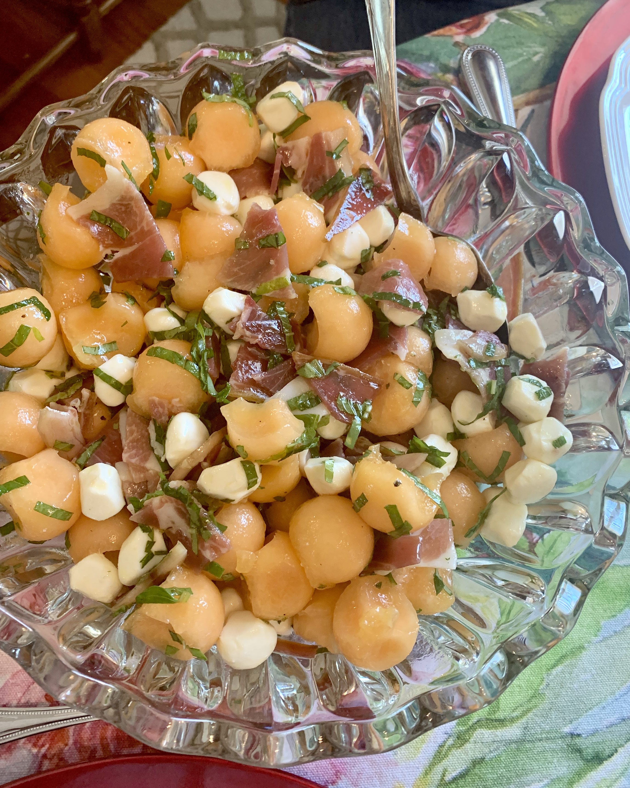

# Cantaloupe and Mozzarella Caprese Salad

## Overview

- Prep Time: 10 mins

- Total Time: 10 mins

## Ingredients

- 1 cantaloupe halved and seeded

- 1 8- ounce container mozzarella balls I used pearl size balls

- 8-10 slices prosciutto shredded into large pieces

- 1/4 cup basil leaves thinly sliced

- 1/4 cup mint leaves thinly sliced

- 3 tablespoons extra-virgin olive oil

- 1 1/2 tablespoons honey

- 1 tablespoon white balsamic vinegar

- Kosher salt and freshly ground black pepper to taste

## Method

1. Use a melon baller to scoop balls from the cantaloupe halves and add to a large bowl. Add the mozzarella balls and the torn prosciutto. Sprinkle with the basil and mint leaves.
---
2. In a small bowl, whisk the olive oil, honey and white balsamic vinegar together and season with kosher salt and freshly ground black pepper. Drizzle over the cantaloupe and toss to coat. Season with more salt and pepper and additional herbs to taste.

## References and Acknowledgments

[Cantaloupe and Mozzarella Caprese Salad](https://www.foodiecrush.com/cantaloupe-and-mozzarella-caprese-salad/#wprm-recipe-container-36180)

## Tags

