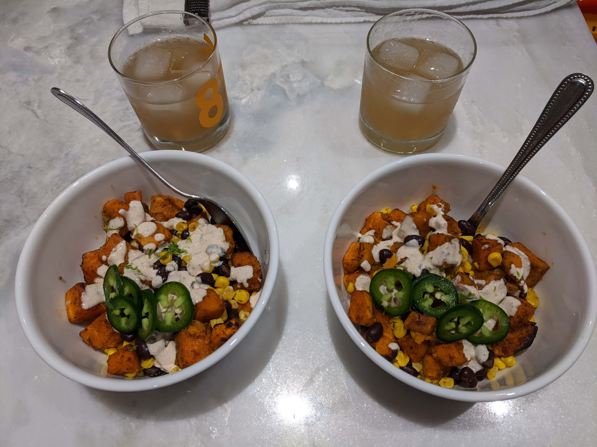

# Sweet Potato Taco Bowls

## Overview

- Yield: 6
- Prep Time: 20 mins
- Cook Time: 40 mins
- Total Time: 1 hr

## Ingredients

- 1 tablespoon chili powder

- 1/4 Teaspoon garlic powder

- 1/4 Teaspoon onion powder

- 1/4 Teaspoon dried oregano

- 1/2 teaspoon paprika

- 1 and 1/2 teaspoon ground cumin

- Seasoned salt and pepper

- 2-3 large sweet potatoes, peeled and chopped (about 4.5-5 cups)

- 3 tablespoons olive oil

- 1 can (15 ounces) black beans, drained and rinsed

- 1 can (15 ounces) fire-roasted sweet corn, drained

- 1-2 large avocados

- 3-4 fresh limes, separated

#### Optional Toppings:

- 1/2 cup sour cream (I use fat free)

- 1 teaspoon hot sauce (like Cholula)

- 1-2 large limes (1/2 teaspoon zest + 3 tablespoons juice)

#### Cilantro-Lime Rice Or Quinoa:

- 1 cup quinoa or rice (+ 2 cups chicken stock, chicken broth, or water)

- 1 tablespoon butter

- 1 large lime (2 tablespoons juice and 1 teaspoon zest)

- 1/3 cup finely chopped cilantro

- Salt and pepper, to taste

## Method

1. Preheat the oven to 425 degrees F.  Combine the seasoning mixture: In a small bowl, stir together the chili powder, garlic powder, onion powder, dried oregano, paprika, ground cumin and 1 teaspoon salt and 1 teaspoon pepper.  Stir.
---

2. Peel the sweet potatoes and chop into bite-sized chunks.  Toss the potatoes with 3 tablespoons olive oil and 1 tablespoon + 2 teaspoons of the seasoning mixture. Toss together with your hands until well coated and then bake for 15 minutes. Remove from the oven, toss around and return for another 15 minutes. Remove, toss around and if needed cook for another 5-10 minutes or until sweet potatoes are tender. Remove the tray and add the drained & rinsed black beans, drained corn, and 1 more teaspoon of the seasoning mixture. Toss everything on the tray (The beans and corn will get warm on the hot tray).
---

3. Meanwhile, make cilantro lime rice or quinoa: Bring 2 cups of water to a boil over medium-high heat. Stir in the butter and rice (or quinoa) and return to a boil. Reduce the heat to low, cover, and simmer until the rice (or quinoa) is cooked through and tender. Stir in the lime juice, lime zest, cilantro, and salt + pepper to taste.
---

4. Make the sauce: combine the sour cream, lime zest & 3 tablespoons freshly squeezed lime juice, Cholula hot sauce, and 1/2 to 1 full tablespoon* of the remaining spice mixture (or add the spice mixture to personal preference). Whisk until smooth.
---

5. Assemble: in bowls or on plates, add the rice as a base. Top with sweet potatoes, corn, & black bean mixture. Add your other desired toppings such as avocado, tomatoes, and additional cilantro. Drizzle the sauce over or serve as a side. Squeeze on some fresh lime and enjoy immediately!
---

6. For leftovers, store the sauce separately from the other ingredients.
---

## Notes

- You'll likely have a bit extra of the seasoning mixture. I wanted to make sure you have more rather than less depending on how much you want to add to the sour cream. I love a lot of spice in the sour cream, but my family preferred less.

## References and Acknowledgments

[Sweet Potato Taco Bowls](https://www.chelseasmessyapron.com/sweet-potato-taco-bowls/)

## Tags
verified
