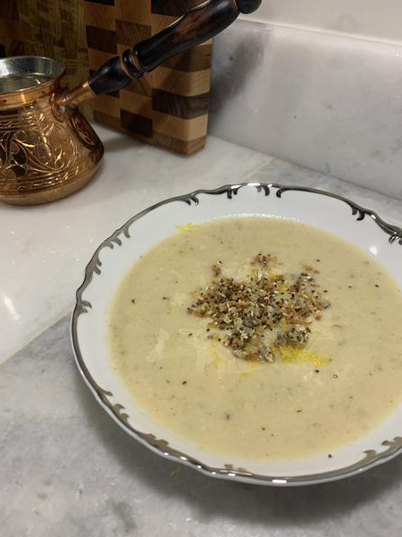

# Asiago Roasted Garlic Cauliflower Soup

## Overview

- Yield: 4 servings
- Prep Time: 10 mins
- Cook Time: 50 mins
- Total Time: 1 hr

## Ingredients

#### For the soup:

- 1 head cauliflower, cut into florets

- 1 tablespoon oil

- salt and pepper to taste

- 2-4 heads garlic

- 2 teaspoons oil

- 1 tablespoon oil

- 1 onion, diced

- 2 teaspoons thyme, chopped (or 1 teaspoon dried thyme)

- 4 cups vegetable broth or chicken broth

- 1 tablespoon white miso paste (optional)

- 1/2 cup asiago, grated

- 1 tablespoon lemon juice

#### For the crunchy topping:

- 1 tablespoon quinoa (raw)

- 2 tablespoons panko breadcrumbs

- 1/2 tablespoon white sesame seeds

- 1/2 tablespoon black sesame seeds

- 1/2 tablespoon chia seeds

- 1/4 cup asiago, grated

- salt and pepper to taste

- 2 teaspoons lemon zest

- 2 tablespoons parsley, chopped

## Method

#### For the soup:

1. Toss the cauliflower in the oil, salt and pepper and arrange in a single layer on a baking sheet.
----
2. Cut the top 1/4 off the heads of garlic, drizzle the oil on top, wrap in foil and place on the baking sheet along with the cauliflower.
----
3. Roast in a preheated 425F/220C oven until the cauliflower is tender and lightly golden brown to a little charred, about 20-30 minutes, mixing the cauliflower half way through.
----
4. Heat the oil in a large sauce pan over medium-high heat, add the onion and cook until tender, about 3-5 minutes.
----
5. Add the thyme and cook until fragrant, about a minute.
----
6. Add the broth, roasted cauliflower and garlic, squeezed from the skins, bring to a boil, reduce the heat and simmer for 10 minutes before pureeing with a stick blender, in a blender or in a food processor.
----
7. Mix in the miso and asiago and heat until the cheese melts into the soup, about a minute, before adding the lemon juice.
----

#### For the crunchy topping:

1. Heat the quinoa in a pan over medium heat until the quinoa starts popping, and then slows down until there is more than a second between pops, mixing continuously to prevent burning.
----
2. Mix in the breadcrumbs, seeds, asiago and toast for a minute or two.
----
3. Mix in the lemon zest and parsley before serving as garnish on the soup.
----

#### Option:
Start by cooking bacon in the pan until crispy before setting aside and continuing on with step 4 using the bacon grease instead of oil to cook the onions in.

#### Option:
Add 1 cup heavy cream, milk or almond milk, etc. to make it creamier.

#### Option:
Add 1/4 cup tahini to the soup to make it extra creamy.

## References and Acknowledgments

[Closet Cooking - Asiago Roasted Garlic Cauliflower Soup](http://www.closetcooking.com/2017/03/asiago-roasted-garlic-cauliflower-soup.html)

## Tags
verified
