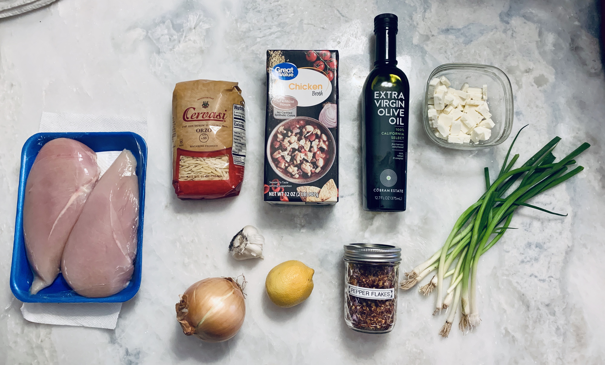

# Recipe Name

## Description

## Overview

- Yield: 8 servings
- Prep Time: 10 mins
- Cook Time: 20 mins
- Total Time: 30 mins

## Ingredients

- 10 cups chicken broth

- 3 tablespoon olive oil

- 8 cloves garlic, minced

- 1 sweet onion

- 1 large lemon, zested

- 2 boneless skinless chicken breasts

- 1 cup Israeli couscous (pearl)

- 1/2 teaspoons crushed red pepper

- 2 ounces crumbled feta

- 1/3 cup chopped chive

- Salt and pepper

## Method

1. Place the olive oil in a large 6-8 quart sauce pot over medium-low heat. Peel the onion. Then quarter it and slice into thin strips. Once the oil is hot, saute the onion and minced garlic for 3-4 minutes to soften.
---

2. Add the chicken broth, raw chicken breasts, lemon zest, and crushed red pepper to the pot. Raise the heat to high, cover, and bring to a boil. Once boiling, reduce the heat to medium, then simmer for 5 minutes.
---

3. Stir in the couscous, 1 teaspoon salt, and black pepper to taste. Simmer another 5 minutes. Then turn the heat off.
---

4. Using tongs, remove the two chicken breasts from the pot. Use a fork and the tongs to shred the chicken. Then place it back in the pot. Stir in the crumbled feta cheese and chopped chive. Taste and salt and pepper as needed. Serve warm.
---

## References and Acknowledgments

[A Spicy Perspective](https://www.aspicyperspective.com/greek-lemon-chicken-soup/)

## Tags
verified
