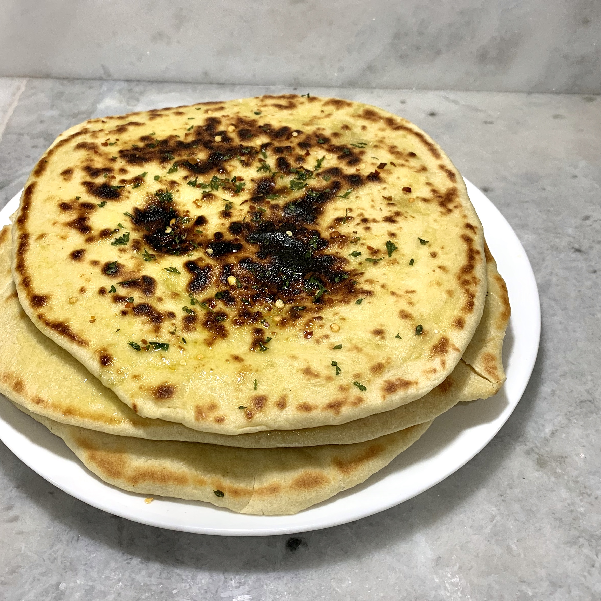

# Bazlama Turkish Flatbread

## Overview

- Yield: 6 flatbreads

## Ingredients

- 500 g (1 pound) flour

- 150 ml (5 fl. oz) warm milk

- 150 ml (5 fl. oz) warm water

- 1 tsp salt

- 2 tbsp dry yeast

- 3 tbsp olive oil

- chopped parsley, chili flakes

## Method

1. Whisk flour with salt and yeast. Add warm water and milk and knead just until liquids absorb.
---

2. Add olive oil and knead until smooth dough forms (around 10 minutes).
---

3. Form the dough into a ball, cover with vegetable oil and set aside in warm place for 1 hour or until doubled in size.
---

4. When the dough is done rising, cut it into 6 and roll each piece into a ball.
---

5. Roll out each flatbread and place on a pan preheated on medium-high heat. Cook for 5-6 minutes (2.5-3 minutes on each side). When you flip each flatbread it should rise up to make a pocket in the middle.
---

6. Brush each hot flatbread with oil, then top with parsley and chili flakes.
---

## References and Acknowledgments

[Bazlama Turkish Flatbread](https://old.reddit.com/r/GifRecipes/comments/g2dsym/bazlama_turkish_flatbread/fnktcgq/)

## Tags
verified
