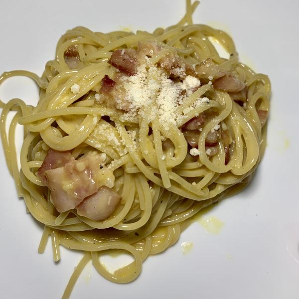

# NYT Spaghetti Carbonara

## Overview

- Yield: 4 servings
- Total Time: 25 mins

## Ingredients

- 2 ounces spaghetti (about 3/4 box)

-  ½ ounces of slab guanciale (see recipe), pancetta or bacon, sliced into pieces about 1/4 inch thick by
- /3 inch square

-  large eggs and 2 large yolks, room temperature

-  ounce (about 1/3 packed cup) grated pecorino Romano, plus additional for serving

-  ounce (about 1/3 packed cup) grated Parmesan

- oarsely ground black pepper

-  tablespoon olive oil

## Method

1. Place a large pot of lightly salted water (no more than 1 tablespoon salt) over high heat, and bring to a boil. Fill a large bowl with hot water for serving, and set aside.
---
2. In a mixing bowl, whisk together the eggs, yolks and pecorino and Parmesan. Season with a pinch of salt and generous black pepper.
---
3. Set the water to boil. Meanwhile, heat oil in a large skillet over medium heat, add the pork, and sauté until the fat just renders, on the edge of crispness but not hard. Remove from heat and set aside.
---
4. Add pasta to the water and boil until a bit firmer than al dente. Just before pasta is ready, reheat guanciale in skillet, if needed. Reserve 1 cup of pasta water, then drain pasta and add to the skillet over low heat. Stir for a minute or so.
---
5. Empty serving bowl of hot water. Dry it and add hot pasta mixture. Stir in cheese mixture, adding some reserved pasta water if needed for creaminess. Serve immediately, dressing it with a bit of additional grated pecorino and pepper.
---

## References and Acknowledgments

[NYT](https://cooking.nytimes.com/recipes/12965-spaghetti-carbonara)

## Tags
verified