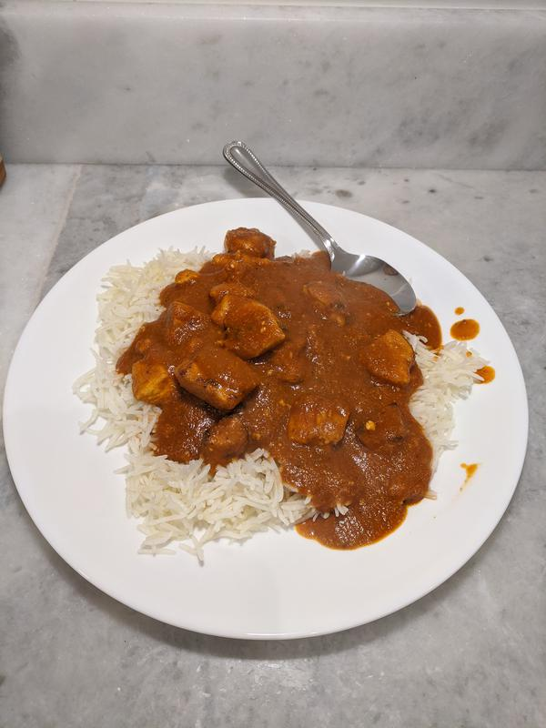

# Chicken Tikka Masala

## Overview

- Yield: 6 servings
- Prep Time: 30 mins
- Cook Time: 26 mins
- Total Time: 56 mins

## Ingredients

#### For The Spice Mixture:

- 1 tablespoon garam masala

- 1 tablespoon ground cumin

- 1 tablespoon ground coriander

- 2 teaspoons ground turmeric

- 2 teaspoons kosher salt

- 1 teaspoon smoked paprika

- 1/2 teaspoon cayenne pepper

#### Chicken Tikka Masala:

- 2 pounds boneless, skinless chicken breasts or thighs, cut into cubes

- 1 cup plain, full-fat yogurt

- 6 cloves garlic, grated, divided

- 1 tablespoon freshly grated ginger, divided

- 2 tablespoons oil

- 1 tablespoon butter

- 1 medium onion, finely diced

- 1 can (15 ounces) canned tomato sauce or crushed tomatoes

- 1 cup coconut milk or heavy cream

- Fresh cilantro, chopped, to serve

- 4 cups basmati rice, to serve

- Homemade garlic naan, to serve

## Method

1. In a small bowl, whisk together the spices. Set aside.
---
2. In a large bowl, combine the chicken, yogurt, half of the garlic, half of the ginger, and half of the spice mixture, reserving the rest for later. Stir, cover, and allow to marinate for at least 15 minutes, or overnight.
---
3. In a large, heavy bottomed pot or high-walled pan, heat the oil and butter over medium-high. Remove the chicken from the marinade and add to the pot in batches. Cook until browned all over and beginning to char, turning once, about 6 minutes total. Remove from the pan and set aside for later. Repeat until all of the chicken is browned.
---
4. Add the chopped onion and the remaining garlic, ginger, and spices to the pot. Cook, stirring occasionally, until the onion softens, about 4 minutes. Add the crushed tomatoes and gently scrape the bottom of the pan with a wooden or rubber spoon to release the browned bits while stirring.
---
5. Pour in the coconut milk and add the chicken back to the pot. Stir and reduce to low heat. Let simmer for 10 minutes, stirring occasionally. Garnish with chopped cilantro and serve over basmati rice with naan.
---

## References and Acknowledgments

[Chicken Tikka Masala](https://hostthetoast.com/easy-chicken-tikka-masala/)

## Tags
easy
