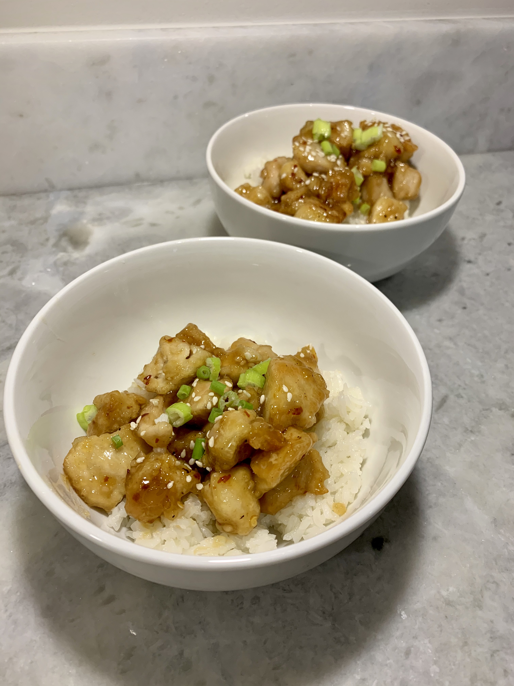

# Chinese Honey Garlic Chicken

## Overview

- Yield: 4 servings
- Prep Time: 10 mins
- Cook Time: 20 mins
- Total Time: 30 mins

## Ingredients

- 2-3 boneless skinless chicken breasts, pounded to 1/2 inch thickness

- salt and pepper, to taste

- 3 tablespoons oil

- 1/2 cup corn starch

#### Sauce

- 2 teaspoons garlic

- 1/3 cup honey

- 1 teaspoon apple cider vinegar (may sub white vinegar)

- 1/2 cup white vinegar

- 1 teaspoon soy sauce

- 1/2 teaspoon crushed red pepper flakes (optional)

- 2 tablespoons cold water

- 1 tablespoon corn starch

- Optional: scallions, sesame seeds, cooked white or brown rice or fried rice

## Method

1. Heat oil in a large pan or skillet over medium heat. Chop the chicken into bite sized pieces. Toss the chicken pieces in the corn starch. Cook the coated chicken in the preheated pan 6-8 minutes, stirring occasionally to ensure even cooking, until chicken is cooked through and crisp on the outside.
---
2. In a small sauce pan whisk together all sauce ingredients except for corn starch slurry. Bring to a boil. In a small bowl combine cold water and corn starch for the slurry. Add to boiling sauce. Reduce to a simmer and allow to cook a couple more minutes until thick.
---
3. Add sauce to chicken and stir to coat. Serve with rice and scallions or sesame seeds if desired.
---

## References and Acknowledgments

[Chinese Honey Garlic Chicken](http://lecremedelacrumb.com/2014/05/chinese-honey-garlic-chicken.html)

## Tags
verified
