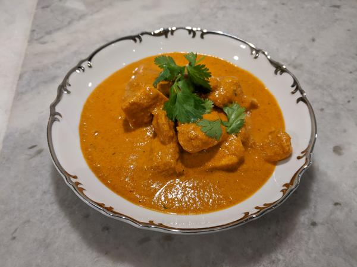

# Standard Butter Chicken

## Overview:

- Prep time: 30 minutes
- Cook time: 30 minutes
- Marinating time: 30 minutes minimum, 8 hours maximum
- Yield: 4 servings

## Ingredients

#### Marinade:

- 1 pound boneless, skinless chicken thighs, cut into roughly 1-inch cubes

- 1/4 cup full-fat plain yogurt

- 1 tablespoon olive oil

- 1 tablespoon ginger garlic paste

- 1 teaspoon dried coriander

- 1 teaspoon Paprika

- 1 teaspoon cumin

- Salt to taste

#### Sauce:

- 8 to 10 whole almonds

- 8 to 10 whole cashews

- 2 tablespoons unsalted butter - divided in 1.5 and 0.5 tablespoon parts

- 1/2 tablespoon ginger paste

- 1/2 tablespoon garlic paste (crush some minced garlic if paste is unavailable)

- 1 teaspoon sugar

- 1 (15-ounce) can canned diced tomatoes (or tomato sauce for an easier time)

- 2 tablespoons ground coriander

- 1 1/2 teaspoons ground Garam Masala

- 1/2 teaspoon ground Paprika

- 1/2 teaspoon ground red chilli powder

- 1/2 teaspoon salt

- 1 cup water

- 1/4 cup heavy cream

- 1/2 tablespoon Kasuri Methi

## Method:

#### 1 - 24 hrs before mealtime:

1. Marinate the chicken: Bring the chicken and the rest of the marinade ingredients together in a large bowl. Using your hands, massage the marinade into the chicken. Cover with plastic wrap and refrigerate for at least 1 hour, or up to overnight.
---
2. Soak cashews and almonds in water for at least an hour to (or up to overnight) before preparing the rest of the recipe.
---

#### Hour-of Meal Prep:

3. Cook the chicken: Heat a skillet or grill pan over medium-high heat. Drizzle a teaspoon of oil to the pan.
---

4. Working in batches, remove chicken from the marinade and grill them on the pan for 3 to 5 minutes on each side, until the chicken is cooked through (clear juice runs out of it when you cut into it). Do not crowd the pan.
---

5. Once cooked, transfer the chicken into a separate dish. Cover and set aside for later.
---

6. Start making the sauce: Melt 1 1/2 tablespoons of the butter in a medium sized Dutch oven or a skillet on medium low heat. As soon as the butter melts, add the ginger garlic paste followed by sugar. Sauté for 1 to 2 minutes.
---

7. Stir in the tomato and cook for 8 to 10 minutes on medium high heat, until all the extra liquid is cooked off. The sauce should be a loose, paste-like consistency.
---

8. Add coriander, garam masala, paprika, red chilli powder, and salt. Stir and cook on medium heat for 2 to 3 minutes. Turn off the heat.
---

9. Puree the sauce with the nuts: Transfer the paste to a blender or the bowl of a food processor.
---

10. Add the soaked cashews and almonds. Blend into a smooth paste.
---

11. Finish the dish: Return the paste to the cooking pan over medium heat. Add the water to the paste and stir to make a smooth sauce.
---

12. As the sauce starts to boil, add the grilled chicken and heavy cream. Stir well. Cover the pan and simmer for 5 minutes.
---

13. Rest the butter chicken: Turn off the heat and uncover the pan.
---

14. Stir in the remaining 1/2 tablespoon butter and the kasuri methi.
---

15. Cover again, and let the dish rest for 8 to 10 minutes so the flavor of kasuri methi can marry into the butter chicken.
---

## Notes

- Serve with a side of steamed basmati rice, roti, or naan. Leftovers will keep refrigerated, covered, for 5 days.

- You can freeze this dish in an airtight covered container or a zip-top bag for a month. Thaw and reheat in a saucepan over medium-low heat to retain the texture.

## Tags
verified
