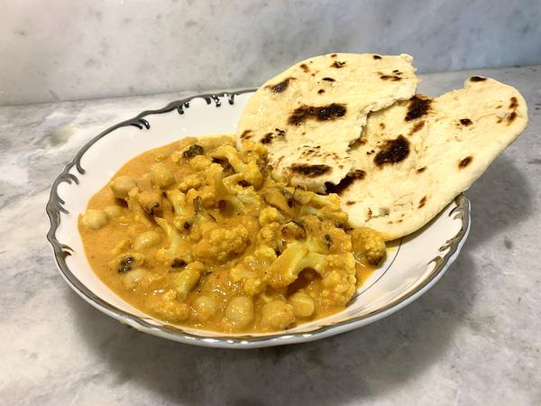

# Cauliflower and Chickpea Coconut Curry

## Overview

- Yield: 4 servings

- Prep Time: 20 mins
- Cook Time: 20 mins
- Total Time: 40 mins

## Ingredients

- 1 large cauliflower, cut into bite-sized florets

- 2 tablespoons grapeseed oil, or preferred oil (plus more for roasting)

- 1/2 medium red onion, diced (sub yellow onion)

- 1 small serrano pepper, sliced (sub jalapeño or 1/2 tsp red pepper flakes)

- 4 cloves garlic, minced or chopped

- 1 tablespoon fresh ginger, grated (sub frozen or paste)

- 1 tablespoon curry powder, more if desired

- 1 14 ounce can diced tomatoes

- 2-3 teaspoons agave nectar (or any sweetener)

- 1 14 ounce can coconut milk, full-fat

- 1 15 ounce can chickpeas, rinsed and drained well

- 1 lime, juiced

- 1/3 cup cilantro, chopped (more for serving)

- 3/4 teaspoon salt, more to taste (more for roasting)

- Fresh cracked pepper, to taste

## Method

1. Preheat oven to 450° F (230° C). Place cauliflower florets on a rimmed baking sheet. Drizzle with oil and lightly sprinkle with salt and pepper to taste. Combine together with your hands. Roast for 15-20 minutes until tender and lightly browned. Toss halfway.
---
2. To make the curry sauce (I usually start this after the cauliflower has been roasting for 5 minutes). In a large pan, heat oil over medium heat. Add onions and sauté until translucent, about 2-3 minutes. Now add serrano peppers and sauté for 1-2 minutes until slightly softened.
---
3. Add garlic and ginger and sauté for 1 minute until fragrant. Now add the curry powder and sauté until fragrant, about 30-60 seconds.
---
4. Add diced tomatoes, agave and salt. Cook for 2-3 minutes to soften and meld flavors. Pour in coconut milk and lightly simmer for 3-4 minutes to reduce (don't boil - lower heat if needed).
---
5. Transfer to a blender and blend on high until smooth (you can skip blending if you want a chunkier sauce - just simmer a few minutes more to thicken). Pour back into pan along with chickpeas and lime juice. Gently simmer to warm throughout and soften chickpeas.
---
6. Now add roasted cauliflower and gently toss to combine well (heat longer if needed). Taste for seasoning and add more if needed. Remove from heat, sprinkle with cilantro. Top over rice and serve with naan, lime wedges, and cut cilantro if desired. Enjoy!

## Notes

- Flavor enhancing ideas: 1/2-1 teaspoon cumin, coriander, cinnamon, turmeric. Add to the pan with curry powder.

- For more heat, add 1 more small serrano pepper. To reduce the heat slightly, you can remove all or some of the serrano pepper seeds. You can also cook the peppers at the same time as the onions to reduce their heat. Also, you can use jalapeños because they have less heat than serrano peppers.

## References and Acknowledgments

[Cauliflower and Chickpea Coconut Curry](https://veganhuggs.com/chickpea-coconut-curry/?fbclid=IwAR3kybzVGFv9DTZAKL0Tjyn0GNSnsVffOK0rUDd_HPjMfb3JtYiTedrSgm8)

## Tags
verified
