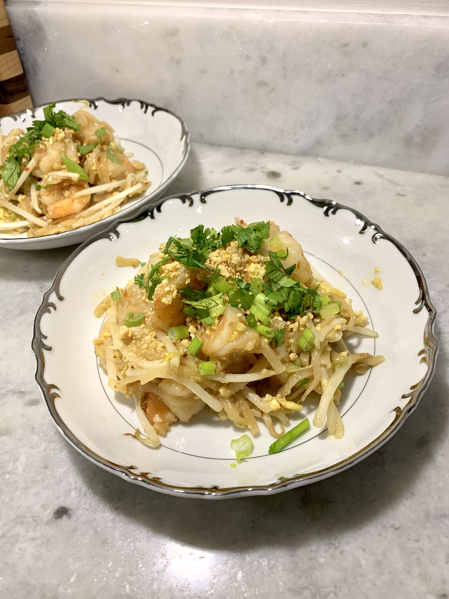

# Garlic Butter Shrimp Pad Thai

## Overview

- Yield: 4 servings
- Prep Time: 15 mins
- Cook Time: 15 mins
- Total Time: 30 mins

## Ingredients

- 8 ounces wide rice noodles

- 3-4 tablespoons low sodium soy sauce, using more or less to taste

- 2 tablespoons fish sauce

- 2 tablespoons white vinegar

- 3 tablespoons honey or maple

- 1/4-1 teaspoon chili flakes, plus more for serving

- 1 pound raw jumbo shrimp, peeled and deveined

- 3 tablespoons peanut oil or extra virgin olive oil

- 4-6 cloves garlic, finely chopped or grated

- 3 tablespoons salted butter

- 2-3 eggs, beaten

- 2 cups bean sprouts or chopped baby bok coy (or other greens)

- 4 green onions, chopped, plus more for serving

- 1/4 cup roasted peanuts, chopped

- Thai or regular basil and limes, for serving

## Method

1. Cook the rice noodles according to packaged directions.
---
2. To make the sauce. In a small bowl, combine the soy sauce, fish sauce, vinegar, honey, and chili flakes.
---
3. Heat the olive oil in a large skillet over medium heat. When the oil shimmers, add the shrimp and sear on both sides until pink, 2-3 minutes. Add the butter, garlic, a pinch of both chili flakes and black pepper. Continue to cook the shrimp in the butter until the garlic begins to caramelize and turn light golden brown, another 1-2 minutes.
---
4. Add the noodles and sauce, tossing to combine. Cook until the noodles are warmed through and begin soaking up the sauce, about 1 minute. Push the noodles to one side of the skillet and add the eggs to the other side. Let cook until the edges start to set, 1 minute. Roughly scramble the egg, then toss with the noodles. Remove from the heat. Add the bean sprouts and green onions, toss to combine.
---
5. Divide the noodles and shrimp between plates. Top with basil, green onions, peanuts, and chili flakes. Add a squeeze of lime juice.
---

## References and Acknowledgments

[Garlic Butter Shrimp Pad Thai](https://www.halfbakedharvest.com/shrimp-pad-thai/#bo-recipe)
