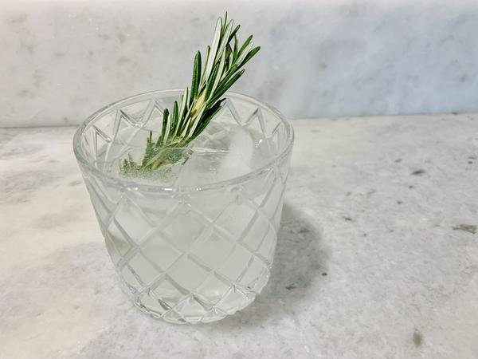

# Cucumber Rosemary Gin & Tonic

## Overview

- Yield: 1

- Prep Time: 5 mins

- Total Time: 5 mins

## Ingredients

- 1 cucumber

- 1 lime

- 2 sprigs rosemary

- 2 oz. Gin

- 4 oz. tonic water

- Ice

## Method

1. Peel one half of a cucumber, and slice a lime into eight wedges. In a highball glass, add three slices of peeled cucumber, 1 sprig rosemary, juice from a lime wedge and 1 ounce gin and muddle.
---
2. Strain through a mesh strainer into a second highball glass. Add several cubes of ice, and three slices of unpeeled cucumber. Top with remaining gin and tonic, and serve garnished with rosemary sprigs.

## References and Acknowledgments

[Cucumber Rosemary Gin & Tonic](https://www.thekitchn.com/recipe-cucumberrosemary-gin-an-124907)

## Tags
verified
