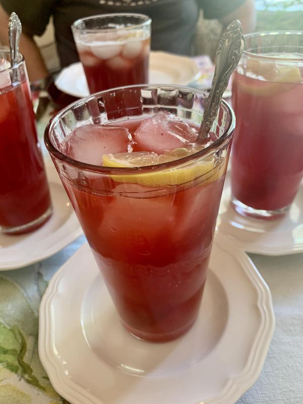

# Sparkling Raspberry Lemonade

## Overview

- Yield: 8

## Ingredients

- 1 12 oz bag frozen raspberries, thawed (or 12 oz fresh raspberries)

- 1/4 cup granulated sugar

- 1 12 oz can frozen lemonade concentrate, thawed in the fridge

- 2 Liter bottle club soda chilled

- Fresh ice to serve

- Fresh raspberries and slices of lemon for garnish optional

## Method

1. In the bowl of an electric blender, puree together the thawed lemonade can with 1/4 cup sugar and 1 bag of thawed raspberries.
---

2. If you don't want the seeds to be present in your lemonade, you can strain the syrup through a cheese cloth or sieve pressing on the seeds to get as much syrup through as possible. This part is a little annoying but it really only takes a few minutes. Discard leftover seeds
---

3. Just before your party, combine the raspberry lemonade mixture with your club soda in your punch bowl and toss in fresh raspberries and lemon slices for prettiness.
---

4. Note: If you want to make individual cups, add ice to a tall glass then top with 1/3 cup of raspberry syrup and gently pour in 1 cup club soda then toss in some raspberries and a slice of lemon for vacation effect
---

## References and Acknowledgments

[Sparkling Raspberry Lemonade](https://natashaskitchen.com/sparkling-raspberry-lemonade/)

## Tags
verified
