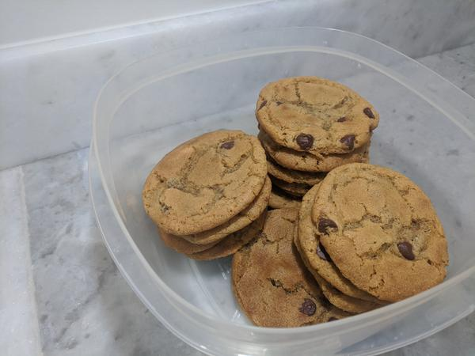

# Broiled Chocolate Chip Cookies

## Overview

- Yield: 18 cookies / 3 pans
- Prep Time: 45 mins
- Cook Time: 36 mins: (3 x 12 mins)
- Total Time: 1.5 hrs

## Ingredients

- 2 sticks salted butter

- 2 cups sugar

- 1 Tbsp molasses

- 2 eggs

- 1 Tbsp vanilla extract

- 2 tsp salt

- 1 tsp baking soda

- 2.5 cups bread flour

- 12-ounce bag chocolate chips

## Method

#### Dough:

1. Pre-heat oven to 375 Fahrenheit.
---

2. Melt the butter completely before mixing in the sugar, molasses, eggs and vanilla until smooth.
---

3. Mix in the baking soda and two cups of the flour.
---

4. Add more flour until dough appears wet but is not terribly sticky.
---

5. Refrigerate dough for at least 30 min.
---

6. Form the chilled dough into balls the size of golf balls.
---

7. Smash them into the shapes of hockey pucks and place them on parchment-lined baking sheets. This should yield about 18 big cookies, spread across three pans.
---

#### Bake:

1. Turn on the broiler and broil the tops of the cookies, one pan at a time on a high rack, until golden (30 sec - 1 min). Return the oven to 375 on its baking mode, allow the broiler to cool for a moment, then bake the cookies for ~10 minutes.
---

## Notes

## Source

[Adam Regusea](https://www.youtube.com/watch?v=OnGrHD1hRkk)

## Tags
