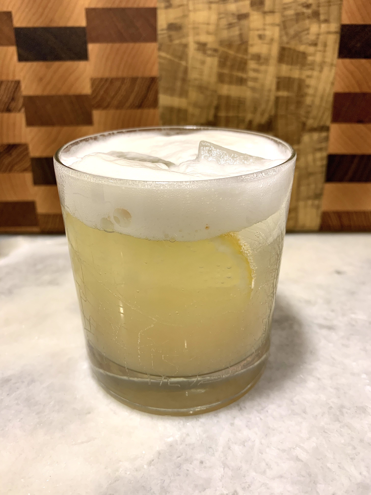

# Classic Gin Fizz

## Overview

- Yield: 1

- Prep Time: 5 mins

- Total Time: 5 mins

## Ingredients

- 2 oz Gin (modern alternatives reduce to 1 1/2 oz)

- 1 oz Fresh lemon juice (modern alternatives reduce to 3/4 oz)

- 3/4 oz Simple syrup

- 1 Egg white (about 1/2 oz)

- 1 oz Club soda

## Method

1. Add the first four ingredients to a shaker and dry-shake (without ice) for about 10 seconds.
---
2. Add 3 or 4 ice cubes and shake very well.
---
3. Double-strain into a chilled fizz glass and top with club soda.

## Notes

- You can omit the egg white if desired. If so, you don't have to dry shake ingredients first.

- Variation: [Rosemary Gin Fizz](http://cookieandkate.com/2011/rosemary-gin-fizz/) (adapted) - substitute simple syrup for 1/2 tsp honey. Muddle lemon juice, honey, and 3 1-inch sprigs of rosemary in glass and top with ice, gin, and soda. **OR** just substitute with rosemary simple syrup #todo

## References and Acknowledgments

[Classic Gin Fizz](https://www.liquor.com/recipes/gin-fizz/)

## Tags
verified
