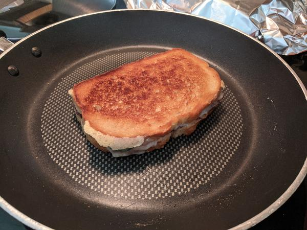

# Blackberry Bacon Grilled Cheese

## Overview

- Yield: 1 sandwich
- Prep Time: 5 min
- Total Time: 15 min

## Ingredients

- 1 Tbsp. butter

- 2 pieces sourdough bread

- 4 slices Swiss cheese

- 4 pieces bacon cooked

- 1/2 jalapeno sliced (*for less spice, remove seeds)

- 3 Tbsp. blackberry jam

## Method

1. Butter one side of each slice of bread. Place bread, butter side down, in skillet.
---

2. Top one piece of bread with cheese, bacon, and jalapeños.
---

3. Top the other piece of bread with blackberry jam.
---

4. Put sandwich together; grill over medium heat, flipping after 4-5 minutes.
---

5. Grill until both sides are golden brown and cheese is melted.
---

## References and Acknowledgments

[Blackberry Bacon Grilled Cheese - Cathy Trochelman](https://www.lemontreedwelling.com/blackberry-bacon-grilled-cheese/)

## Tags
verified
